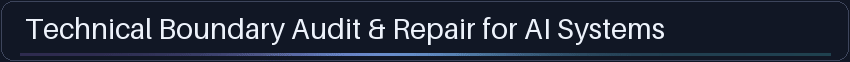
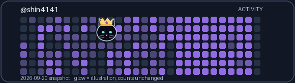
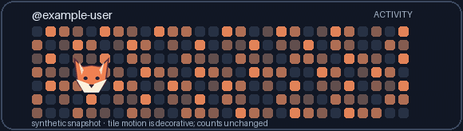

# Compact profile motion — V216 review prototype

The working prototype lives inside [V13 LoopKit](https://github.com/shin4141/decision-os-v13-loopkit), not a new repository. It creates self-contained GIF images for README embedding; it does **not** alter or replace GitHub's native contribution graph. The heading and placement are a review-only mock; nothing here is published to the live `shin4141/shin4141` profile.

<picture>
  <source media="(max-width: 600px)" srcset="heading_mobile.gif">
  
</picture>





The [full profile layout mock](profile_layout_preview.md) uses the unchanged profile body from [shin4141/shin4141 at `cc3e38f`](https://github.com/shin4141/shin4141/blob/cc3e38f/README.md). The only substitutions are the original heading for an image with equivalent alt text, and one compact GIF after the first paragraph. Proof links, counts and contact are copied intact. No live profile mutation is part of V216.

## Generate your own

Requires Python 3.10+ and Pillow (`python3 -m pip install Pillow`). From the root of this repository:

```sh
python3 examples/profile_motion/render.py --config examples/profile_motion/cat.json --activity examples/profile_motion/shin_activity_2026-09-20.json --seed 216 --out examples/profile_motion/crowned_cat.gif --heading-out examples/profile_motion/heading.gif --heading-mobile-out examples/profile_motion/heading_mobile.gif
python3 examples/profile_motion/render.py --config examples/profile_motion/fox.json --activity examples/profile_motion/example_activity.json --seed 216 --out examples/profile_motion/fox.gif
```

Change only four keys in a JSON config: `username`, `icon` (a local PNG, JPEG or other Pillow-readable image relative to `render.py`), `accent`, `glow` (`#RRGGBB`). Supply a dated activity JSON with matching `username` and a `days` array of `{ "date": "YYYY-MM-DD", "count": nonnegative_integer }`. `--seed` fixes target-cell selection. The same input, seed and renderer yields the same frames; no network is used while rendering. A user's icon needs no alternate animation sprites: the same move, small hop, tilt, touch-like lean and rest apply. The cat and fox icons are original artwork generated by `make_icons.py`; no third-party asset is copied.

The cat example is a frozen public GitHub GraphQL `contributionsCollection` snapshot (read-only, captured at the `observed_at` timestamp in its JSON). The fox input is clearly marked **SYNTHETIC**. `--capture PATH --username LOGIN --from-date YYYY-MM-DD --to-date YYYY-MM-DD` can acquire a fresh snapshot using authenticated `gh api graphql`; review its scope before publishing. `--sample PATH --username LOGIN` writes synthetic data. The renderer never edits an input count: color levels derive from fixed thresholds, while the transient glow is a separate overlay. The caption dates the snapshot; it is not a live graph or evidence of current activity. GitHub contribution counts may be affected by privacy/settings and the API's own rules.

Embed a generated file committed in the same README repository with e.g. ``; in another repository use a stable raw GitHub asset URL. A GIF has no scripts, web fonts, linked resources or network calls. GitHub [documents GIF support in profile README](https://docs.github.com/en/account-and-profile/concepts/personal-profile), [supports `<picture>` in profile README](https://docs.github.com/en/get-started/writing-on-github/getting-started-with-writing-and-formatting-on-github/quickstart-for-writing-on-github), and [notes that SVG inline animation is unsupported](https://docs.github.com/en/repositories/working-with-files/using-files/working-with-non-code-files), which is why the deliverable is GIF. The narrow version wraps the unchanged heading text to two lines; both heading variants have bright text on their own dark card and remain legible against either GitHub theme. If a renderer ignores the `max-width` source, the desktop GIF is still the fallback. Some clients or reduced-motion environments may show just the first frame; it remains legible and contains the label. The softly moving heading adds no strong flash. Alt text in the mock covers both images.

To change the real profile after Shin's visual review, copy the approved images to `shin4141/shin4141` and replace just the heading line / insert the creature line as shown in the mock; verify light/dark and mobile on GitHub before merging. This action is **not** performed here.
